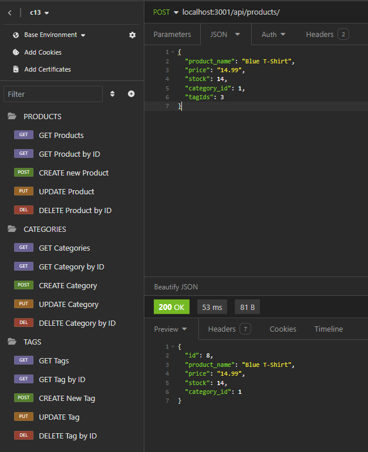

# c13-e-commerce-back-end

## Description
  
This application acts as a databse to be used as the back end for e-commerce, creating an easy way to track and store information pertaining to your stock.
  
## Table of Contents (Optional)
  
 - [Installation](#installation)
 - [Usage](#usage)
 - [Credits](#credits)
 - [Features](#features)
 - [Questions](#questions)
  
## Installation
  
If you've cloned/branched this repo, you'll need to npm install, run the schema.sql, npm run seed, and finally run npm start. Once this is done, you'll be able to use software like Insomnia to view and manipulate the data on the database as you need.
  
## Usage
  
Once you've completed the installation instructions, you can make GET, POST, PUT, and DELETE requests to api/tags/, api/categories/, and api/products/. For manipulation based on ID, use api/products/:id (products is uses as an example).

Or you can [watch a brief video demonstration](https://drive.google.com/file/d/1j4wviciI1lV-m28W0uTu3hd9XWKTtNwR/view)
  
## Credits
  
Shouts out to everyone on stackoverflow, you the realest!

And me, Ian Wolfe.
  
## Features
  
This project features dotenv, express, pg, and sequelize.

## Questions

For any questions about this project, please visit my [GitHub](https://github.com/enkw).
